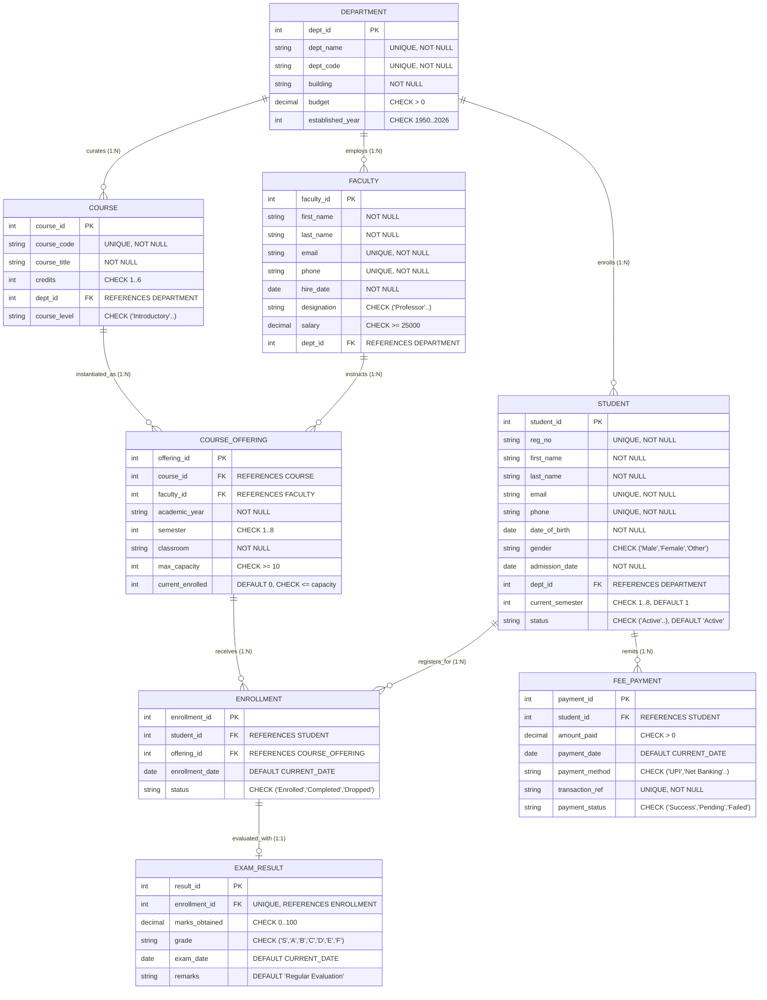
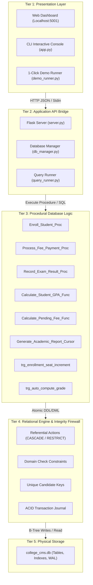
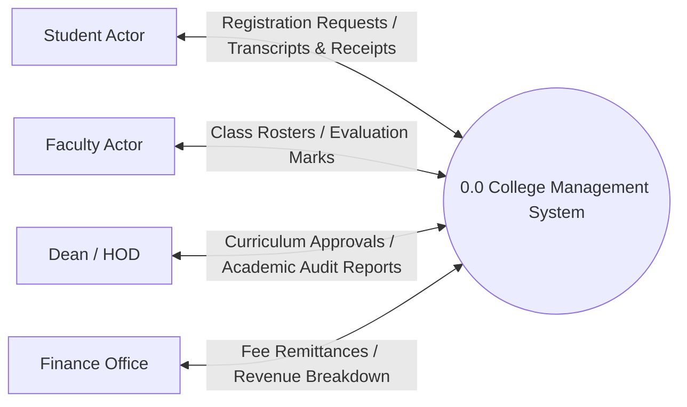
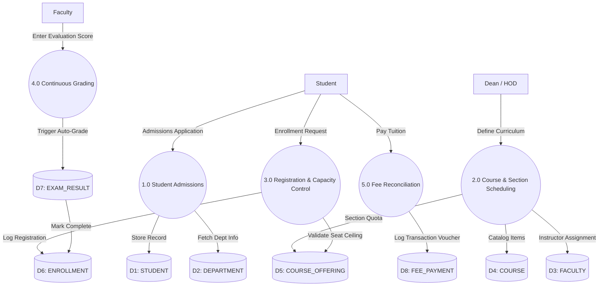
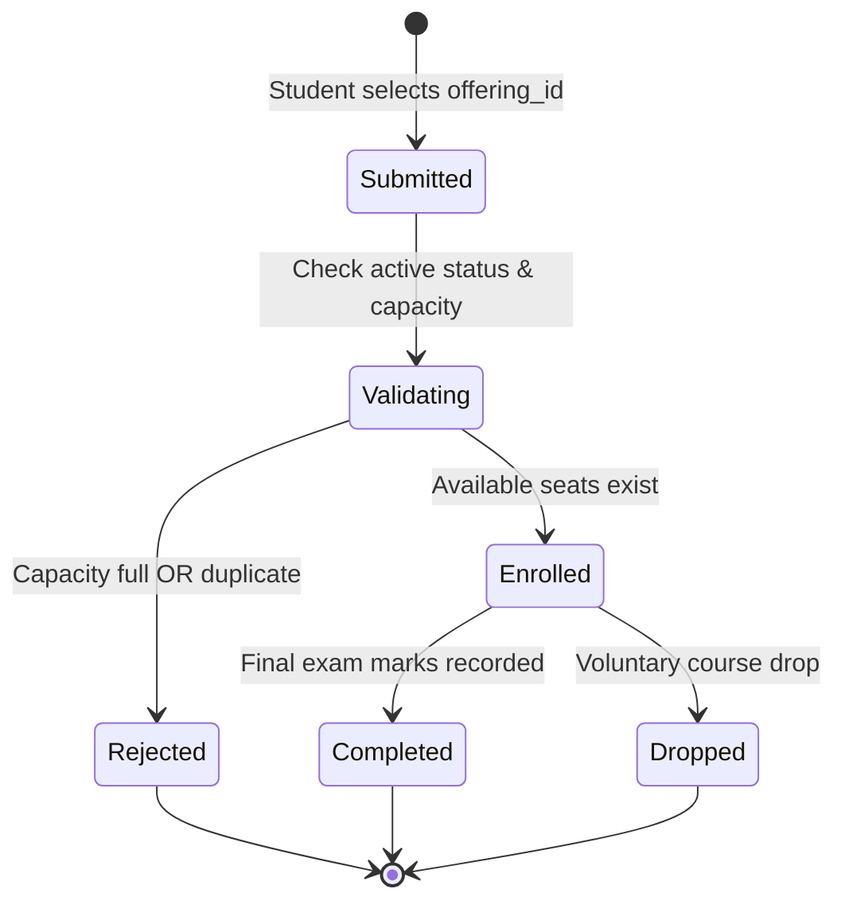
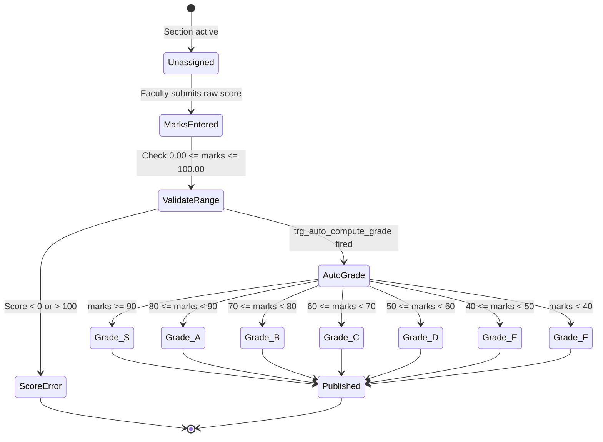
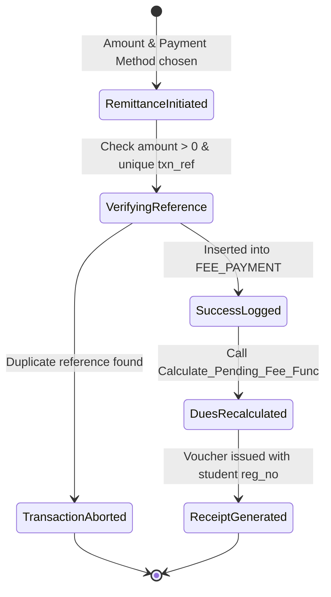

# College Management System - Complete System Visuals & Diagrams
### Course: BCSE302L – Database Systems | Faculty: Course Instructor
### Team: Project Team

---

## Visual 1: Full Relational Entity-Relationship (ER) Diagram (Crow's Foot)



---

## Visual 2: Relational Schema Dependency & Foreign Key Linkage Map

```
┌────────────────────────────────────────────────────────────────────────┐
│                          DEPARTMENT (Root)                             │
│                  PK: dept_id | UQ: dept_code, dept_name                │
└──────────────┬─────────────────────────┬───────────────────────────────┘
               │ (1:N RESTRICT)          │ (1:N RESTRICT)                │ (1:N RESTRICT)
               ▼                         ▼                               ▼
       ┌───────────────┐         ┌───────────────┐               ┌───────────────┐
       │    FACULTY    │         │    STUDENT    │               │    COURSE     │
       │ PK: faculty_id│         │ PK: student_id│               │ PK: course_id │
       │ FK: dept_id   │         │ FK: dept_id   │               │ FK: dept_id   │
       └───────┬───────┘         └───────┬───────┘               └───────┬───────┘
               │ (1:N RESTRICT)          │                               │ (1:N CASCADE)
               │                         │                               │
               └───────────┐             │             ┌─────────────────┘
                           ▼             │             ▼
                 ┌───────────────────────────────────────┐
                 │            COURSE_OFFERING            │
                 │ PK: offering_id                       │
                 │ FK: course_id, faculty_id             │
                 │ UQ: (course, faculty, year, sem)      │
                 └───────────────────┬───────────────────┘
                                     │ (1:N CASCADE)
                                     ▼
                           ┌───────────────────┐
                           │    ENROLLMENT     │ <── (1:N CASCADE from STUDENT)
                           │ PK: enrollment_id │
                           │ FK: student_id    │
                           │ FK: offering_id   │
                           │ UQ: (student, off)│
                           └─────────┬─────────┘
                                     │ (1:1 CASCADE)
                                     ▼
                           ┌───────────────────┐                 ┌───────────────────┐
                           │    EXAM_RESULT    │                 │    FEE_PAYMENT    │
                           │ PK: result_id     │                 │ PK: payment_id    │
                           │ FK: enrollment_id │                 │ FK: student_id    │ <── (1:N CASCADE)
                           └───────────────────┘                 └───────────────────┘
```

---

## Visual 3: 5-Tier Closed-Loop System Architecture



---

## Visual 4: Data Flow Diagram (DFD Level 0 Context & Level 1)

### DFD Level 0 (Context Diagram)


### DFD Level 1 (Operational Decomposition)


---

## Visual 5: Normalization Functional Dependency Graph (BCNF Proof)

```
1. DEPARTMENT:
   dept_id [Superkey] ──> {dept_name, dept_code, building, budget, established_year}
   dept_name [Candidate Key] ──> {dept_id, dept_code, ...}
   dept_code [Candidate Key] ──> {dept_id, dept_name, ...}

2. FACULTY:
   faculty_id [Superkey] ──> {first_name, last_name, email, phone, hire_date, designation, salary, dept_id}
   email, phone [Candidate Keys] ──> {faculty_id, ...}

3. STUDENT:
   student_id [Superkey] ──> {reg_no, first_name, last_name, email, phone, dob, gender, admission_date, dept_id, sem, status}
   reg_no, email, phone [Candidate Keys] ──> {student_id, ...}

4. COURSE:
   course_id [Superkey] ──> {course_code, course_title, credits, dept_id, course_level}
   course_code [Candidate Key] ──> {course_id, ...}

5. COURSE_OFFERING:
   offering_id [Superkey] ──> {course_id, faculty_id, academic_year, semester, classroom, max_capacity, current_enrolled}
   (course_id, faculty_id, academic_year, semester) [Candidate Key] ──> {offering_id, ...}

6. ENROLLMENT:
   enrollment_id [Superkey] ──> {student_id, offering_id, enrollment_date, status}
   (student_id, offering_id) [Candidate Key] ──> {enrollment_id, ...}

7. EXAM_RESULT:
   result_id [Superkey] ──> {enrollment_id, marks_obtained, grade, exam_date, remarks}
   enrollment_id [Candidate Key (1:1)] ──> {result_id, ...}

8. FEE_PAYMENT:
   payment_id [Superkey] ──> {student_id, amount_paid, payment_date, payment_method, transaction_ref, payment_status}
   transaction_ref [Candidate Key] ──> {payment_id, ...}

Conclusion:
In every functional dependency X -> Y across all 8 tables, X is a SUPERKEY.
Therefore, the database is strictly in BOYCE-CODD NORMAL FORM (BCNF) and 3NF.
```

---

## Visual 6: State Transition Lifecycle Statecharts

### 1. Enrollment Lifecycle


### 2. Examination Evaluation Lifecycle


### 3. Tuition Fee Remittance Lifecycle

