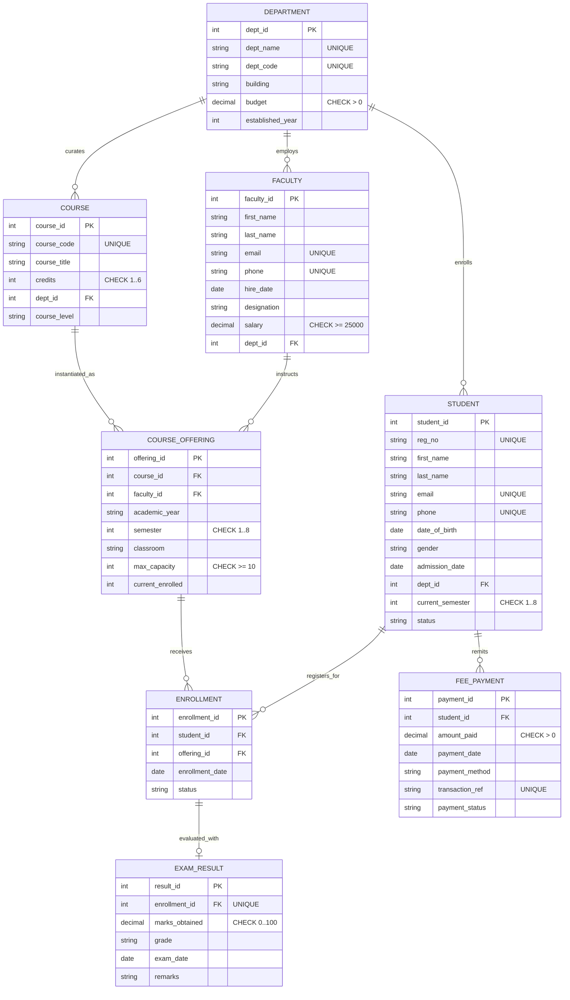

# Entity-Relationship (ER) Diagram - College Management System

**Course:** BCSE302L – Database Systems  
**Faculty In-Charge:** Course Instructor  
**Team Details:**  
- Ansh (REG_01)  
- Student 2 (REG_02)  
- Student 3 (REG_03)  

---

## 1. Visual Entity-Relationship Architecture

---

## 2. Mermaid Relational ER Model

---

## 3. Detailed Entity and Cardinality Justifications

1. **DEPARTMENT to STUDENT (1 : N)**:
   - *Rationale:* Every student is formally enrolled in exactly one parent degree department (`dept_id`). One department admits hundreds of students.
2. **DEPARTMENT to FACULTY (1 : N)**:
   - *Rationale:* Every faculty member is appointed to a primary academic department. A department employs multiple faculty members.
3. **DEPARTMENT to COURSE (1 : N)**:
   - *Rationale:* Courses belong to a curriculum board maintained by a department. A department creates many distinct courses.
4. **COURSE & FACULTY to COURSE_OFFERING (M : N resolved via Ternary/Associative Section)**:
   - *Rationale:* A course can be taught multiple times across semesters by different faculty. A faculty member teaches multiple courses. `COURSE_OFFERING` acts as the associative entity capturing venue, term, and capacity.
5. **STUDENT & COURSE_OFFERING to ENROLLMENT (M : N resolved)**:
   - *Rationale:* A student registers for multiple course offerings per term; a course offering section enrolls multiple students. Resolved via `ENROLLMENT` with a candidate key on `(student_id, offering_id)`.
6. **ENROLLMENT to EXAM_RESULT (1 : 1)**:
   - *Rationale:* Each student enrollment produces exactly one official semester final exam evaluation and letter grade.
7. **STUDENT to FEE_PAYMENT (1 : N)**:
   - *Rationale:* A student makes multiple periodic fee remittances (semester tuition, lab fees, installments) over their academic degree tenure.
