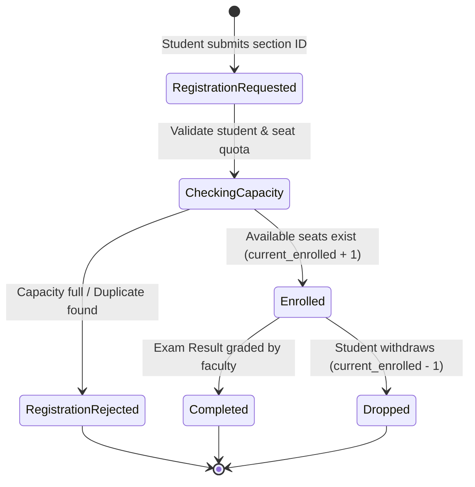
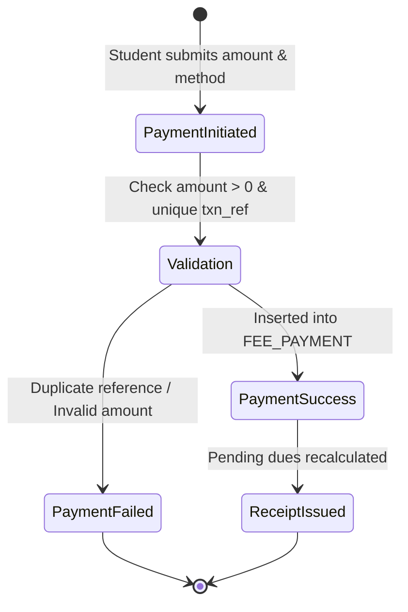
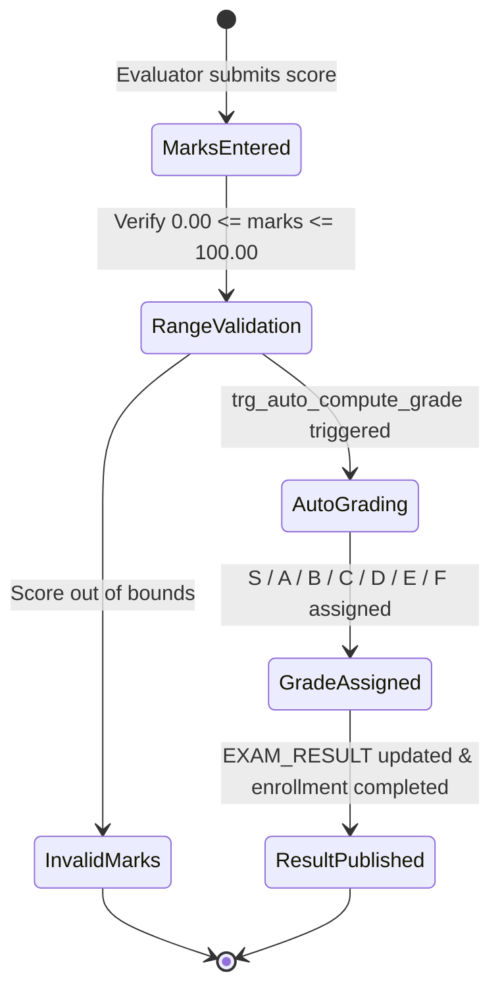

# BCSE302L – Database Systems: Detailed Point 3 Documentation
# FUNCTIONAL REQUIREMENTS & DATABASE REQUIREMENTS
## COLLEGE MANAGEMENT SYSTEM (CMS)

**Course:** BCSE302L – Database Systems  
**Institution:** School of Computer Science and Engineering, Vellore Institute of Technology  
**Faculty In-Charge:** Course Instructor  

### Project Team Details:
| Student Full Name | Registration Number | Degree / Specialization | Email Address |
| :--- | :--- | :--- | :--- |
| **Ansh** *(Lead Architect)* | **REG_01** | B.Tech Data Engineering | `ansh.REG_01@college.edu` |
| **Student 2** | **REG_02** | B.Tech Computer Science | `aneek.REG_02@college.edu` |
| **Student 3** | **REG_03** | B.Tech Data Engineering | `parbhat.REG_03@college.edu` |

---

## 3.1 System Purpose & Closed-Loop Transaction Pipeline

The **College Management System (CMS)** is an integrated enterprise relational database application designed to manage, automate, and audit institutional operations across academic and administrative departments.

Traditional educational record systems often rely on standalone spreadsheets or uncoupled flat files. This leads to severe operational vulnerabilities including phantom course section registrations, desynchronized faculty workloads, arbitrary out-of-range marks entry, and unmonitored fee arrears.

The core objective of this project is to implement a strict, normalized **8-table relational database architecture** wherein every collegiate transaction conforms to a closed-loop execution flow:

```
┌─────────────────┐       ┌───────────────────────┐       ┌────────────────────────┐
│  User Operation │  ───> │  Application Endpoint │  ───> │  PL/SQL Stored Logic   │
│ (Form / Portal) │       │    (Python Bridge)    │       │ (Procedures / Triggers)│
└─────────────────┘       └───────────────────────┘       └───────────┬────────────┘
                                                                      │
                                                                      ▼
┌─────────────────┐       ┌───────────────────────┐       ┌────────────────────────┐
│ Verified Result │  <─── │ State Update / Select │  <─── │    Relational Engine   │
│   (ACID State)  │       │ (Tables Synchronized) │       │ (Constraint Firewall)  │
└─────────────────┘       └───────────────────────┘       └────────────────────────┘
```

Every database component serves a concrete business purpose in university operations rather than acting as a standalone syntactic exercise.

---

## 3.2 Stakeholder Use-Case Specifications (Actor-Goal Matrix)

The system supports four primary institutional actors across academic and administrative departments:

| Institutional Actor | Primary System Interactions | Critical Database Dependencies | Enforced Constraints |
| :--- | :--- | :--- | :--- |
| **Student** | • Browse curriculum catalog<br>• Register for term course offerings<br>• View official grades & CGPA<br>• Remit semester tuition fees | `STUDENT`<br>`COURSE_OFFERING`<br>`ENROLLMENT`<br>`EXAM_RESULT`<br>`FEE_PAYMENT` | • Active student status required<br>• Max section capacity ceiling<br>• No duplicate enrollments<br>• Positive payment amounts |
| **Faculty Member** | • Inspect enrolled class rosters<br>• Monitor seating utilization<br>• Record continuous assessment marks<br>• Submit grade adjustments | `FACULTY`<br>`COURSE_OFFERING`<br>`ENROLLMENT`<br>`EXAM_RESULT` | • Marks bounded within $[0, 100]$<br>• Strict letter grade mapping<br>• Primary key integrity on evaluations |
| **Department HOD / Dean** | • Approve course catalog curriculum<br>• Assign faculty to course offerings<br>• Oversee departmental salary payroll<br>• Generate Academic Audit reports | `DEPARTMENT`<br>`FACULTY`<br>`COURSE`<br>`COURSE_OFFERING`<br>`STUDENT` | • Department budget $> 0$<br>• Faculty salary $\ge 25,000$<br>• Unique course codes<br>• Unique section offerings |
| **Finance Officer / Registrar** | • Issue verified fee receipts<br>• Audit payment gateways (UPI, Cards)<br>• Identify students with fee arrears<br>• Reconcile university revenue | `FEE_PAYMENT`<br>`STUDENT` | • Unique bank transaction reference<br>• Payment methods validated<br>• Real-time outstanding dues balance |

---

## 3.3 Detailed Functional Module Requirements

### Module 1: Student Admission & Profile Management (Transaction 1)
* **Objective:** Capture candidate demographic and academic details during formal admission into an academic department.
* **Pre-conditions:** The referenced `dept_id` must exist in `DEPARTMENT`; student registration number, institutional email, and phone number must be unique.
* **Database Operations:**
  1. System computes next surrogate identifier $\text{NVL}(\max(\text{student\_id}), 200) + 1$.
  2. Executes `INSERT INTO STUDENT` with values for `reg_no`, `first_name`, `last_name`, `email`, `phone`, `date_of_birth`, `gender`, `admission_date`, `dept_id`, `current_semester`, and sets `status = 'Active'`.
* **Tables Affected:** `STUDENT` (INSERT).
* **Integrity Enforcement:** Primary Key uniqueness, `UNIQUE(reg_no)`, `UNIQUE(email)`, `UNIQUE(phone)`, `CHECK(gender IN ('Male', 'Female', 'Other'))`, `CHECK(current_semester BETWEEN 1 AND 8)`.

---

### Module 2: Curriculum Catalog & Course Section Scheduling
* **Objective:** Maintain permanent curriculum standards and instantiate scheduled course offerings for each academic session.
* **Pre-conditions:** Catalog course must be associated with an active department; assigned instructor must belong to `FACULTY`.
* **Database Operations:**
  1. Administrative user defines course entry in `COURSE` with academic credit weight ($1$ to $6$).
  2. Schedulers instantiate a specific section in `COURSE_OFFERING` defining venue, academic term, max seating capacity, and setting initial `current_enrolled = 0`.
* **Tables Affected:** `COURSE` (INSERT), `COURSE_OFFERING` (INSERT).
* **Integrity Enforcement:** `FOREIGN KEY (course_id) REFERENCES COURSE`, `FOREIGN KEY (faculty_id) REFERENCES FACULTY`, `CHECK(max_capacity >= 10)`, `UNIQUE(course_id, faculty_id, academic_year, semester)`.

---

### Module 3: Course Registration & Real-Time Capacity Control (Transaction 2 & Procedure 1)
* **Objective:** Enable active students to register for term sections with automatic class capacity enforcement.
* **Pre-conditions:** Student must have `status = 'Active'`; course offering section must exist and have available seating capacity.
* **Database Operations (PL/SQL Procedure `Enroll_Student_Proc`):**
  1. Validates student existence and active status.
  2. Verifies whether `current_enrolled < max_capacity`. If full, raises `e_class_full` exception.
  3. Queries `ENROLLMENT` to verify student is not already registered. If found, raises `e_already_registered`.
  4. Generates new `enrollment_id` and executes `INSERT INTO ENROLLMENT` with status `'Enrolled'`.
  5. Updates `COURSE_OFFERING`: `SET current_enrolled = current_enrolled + 1`.
* **Tables Affected:** `ENROLLMENT` (INSERT), `COURSE_OFFERING` (UPDATE).
* **Integrity Enforcement:** `UNIQUE(student_id, offering_id)`, `CHECK(current_enrolled <= max_capacity)`.

---

### Module 4: Continuous Assessment & Examination Gradebook (Transaction 3 & Procedure 3)
* **Objective:** Record student evaluation marks and automatically determine standardized letter grades.
* **Pre-conditions:** A valid, active `enrollment_id` must exist.
* **Database Operations (PL/SQL Procedure `Record_Exam_Result_Proc` & Trigger `trg_auto_compute_grade`):**
  1. Validates marks range: $0.00 \le \text{marks\_obtained} \le 100.00$.
  2. Automatically evaluates letter grade:
     $$\text{Grade} = \begin{cases} 
     'S' & \text{if } \text{marks} \ge 90.0 \\ 
     'A' & \text{if } 80.0 \le \text{marks} < 90.0 \\ 
     'B' & \text{if } 70.0 \le \text{marks} < 80.0 \\ 
     'C' & \text{if } 60.0 \le \text{marks} < 70.0 \\ 
     'D' & \text{if } 50.0 \le \text{marks} < 60.0 \\ 
     'E' & \text{if } 40.0 \le \text{marks} < 50.0 \\ 
     'F' & \text{if } \text{marks} < 40.0 
     \end{cases}$$
  3. Executes upsert into `EXAM_RESULT`.
  4. Updates `ENROLLMENT`: `SET status = 'Completed'`.
* **Tables Affected:** `EXAM_RESULT` (INSERT / UPDATE), `ENROLLMENT` (UPDATE).
* **Integrity Enforcement:** `UNIQUE(enrollment_id)` (enforces strict 1:1 evaluation mapping), `CHECK(marks_obtained BETWEEN 0 AND 100)`.

---

### Module 5: Tuition Fee Reconciliation & Voucher Issuance (Transaction 4 & Procedure 2)
* **Objective:** Record institutional fee collections and calculate real-time student tuition dues.
* **Pre-conditions:** Student must exist in the database; remittance amount must be strictly positive.
* **Database Operations (PL/SQL Procedure `Process_Fee_Payment_Proc`):**
  1. Validates student existence and ensures `amount_paid > 0`.
  2. Ensures bank reference code `transaction_ref` is unique to prevent duplicate processing.
  3. Inserts transaction record into `FEE_PAYMENT` with timestamp and method (`UPI`, `Net Banking`, `Credit Card`, `Debit Card`).
  4. Calls stored function `Calculate_Pending_Fee_Func(student_id)` to compute remaining dues:
     $$\text{Pending Dues} = \max(0.00, \; \text{Standard Term Fee} - \sum \text{amount\_paid})$$
* **Tables Affected:** `FEE_PAYMENT` (INSERT).
* **Integrity Enforcement:** `UNIQUE(transaction_ref)`, `CHECK(amount_paid > 0)`, `CHECK(payment_status IN ('Success', 'Pending', 'Failed'))`.

---

### Module 6: Institutional Academic Audit & Honors Classification (Transaction 5 & Cursor 1)
* **Objective:** Iterate through student rosters to compute credit-weighted Cumulative GPAs and generate Dean's Merit classification.
* **Pre-conditions:** Graded enrollments exist in `EXAM_RESULT`.
* **Database Operations (Explicit PL/SQL Cursor `Generate_Academic_Report_Cursor`):**
  1. Declares explicit cursor `cur_student_summary` joining `STUDENT`, `DEPARTMENT`, `ENROLLMENT`, `COURSE`, and `EXAM_RESULT`.
  2. Cursor traverses student records via `OPEN`, `FETCH ... INTO`, `EXIT WHEN %NOTFOUND`, and `CLOSE`.
  3. Dynamically computes Cumulative GPA on a 10.0 scale:
     $$\text{CGPA} = \frac{\sum (\text{Credits}_i \times \text{GradePoint}_i)}{\sum \text{Credits}_i}$$
  4. Classifies honors standing:
     * $\text{Average Marks} \ge 90\% \implies \textbf{Dean's List (Distinction)}$
     * $\text{Average Marks} \ge 75\% \implies \textbf{First Class with Merit}$
     * $\text{Average Marks} \ge 50\% \implies \textbf{Satisfactory / Pass}$
     * $\text{Average Marks} < 50\% \implies \textbf{Academic Warning}$
* **Tables Affected:** Read-only multi-table join across `STUDENT`, `DEPARTMENT`, `COURSE`, `COURSE_OFFERING`, `ENROLLMENT`, `EXAM_RESULT`.

---

## 3.4 Database Requirements & Constraints Specification

### 3.4.1 Justification of 8-Table Scope
The database scope is restricted to **exactly 8 related tables**:
1. **`DEPARTMENT`**: Root academic hierarchy entity preventing duplicate department names and buildings.
2. **`FACULTY`**: Models instructional personnel appointed to departments with compensation controls.
3. **`STUDENT`**: Models enrolled candidates pursuing degree programs.
4. **`COURSE`**: Curriculum definitions independent of semester schedules.
5. **`COURSE_OFFERING`**: Models scheduled classroom sections, venues, and seat capacities.
6. **`ENROLLMENT`**: Associative table resolving Many-to-Many relationship between students and course offerings.
7. **`EXAM_RESULT`**: Evaluated exam scores and letter grades.
8. **`FEE_PAYMENT`**: Financial audit records and payment transaction receipts.

---

### 3.4.2 Comprehensive Constraint Taxonomy

```
┌─────────────────────────────────────────────────────────────────────────────┐
│                          Integrity Constraints                              │
├─────────────────────┬────────────────────────┬──────────────────────────────┤
│ Constraint Category │ Implementation Syntax  │ Institutional Purpose        │
├─────────────────────┼────────────────────────┼──────────────────────────────┤
│ Primary Key (PK)    │ INTEGER PRIMARY KEY    │ Surrogate identity guarantee │
│ Foreign Key (FK)    │ REFERENCES Parent(PK)  │ Referential relationship     │
│ NOT NULL            │ NOT NULL               │ Mandatory data presence      │
│ UNIQUE              │ UNIQUE (col1, col2)    │ Candidate key enforcement    │
│ Domain CHECK        │ CHECK (condition)      │ Business logic validity      │
│ DEFAULT             │ DEFAULT value          │ Automated state assignment   │
└─────────────────────┴────────────────────────┴──────────────────────────────┘
```

#### Detailed Table Constraint Matrix:
* **`DEPARTMENT`**:
  * `dept_id` [PRIMARY KEY]
  * `dept_name` [NOT NULL, UNIQUE]
  * `dept_code` [NOT NULL, UNIQUE]
  * `budget` [NOT NULL, `CHECK (budget > 0)`]
  * `established_year` [NOT NULL, `CHECK (established_year BETWEEN 1950 AND 2026)`]
* **`FACULTY`**:
  * `faculty_id` [PRIMARY KEY]
  * `email` [NOT NULL, UNIQUE]
  * `phone` [NOT NULL, UNIQUE]
  * `salary` [NOT NULL, `CHECK (salary >= 25000)`]
  * `designation` [NOT NULL, `CHECK (designation IN ('Professor', 'Associate Professor', 'Assistant Professor', 'Lecturer', 'Dean', 'HOD'))`]
  * `dept_id` [FOREIGN KEY $\to$ `DEPARTMENT(dept_id)` ON DELETE RESTRICT]
* **`STUDENT`**:
  * `student_id` [PRIMARY KEY]
  * `reg_no` [NOT NULL, UNIQUE]
  * `email` [NOT NULL, UNIQUE]
  * `phone` [NOT NULL, UNIQUE]
  * `gender` [NOT NULL, `CHECK (gender IN ('Male', 'Female', 'Other'))`]
  * `current_semester` [NOT NULL, DEFAULT 1, `CHECK (current_semester BETWEEN 1 AND 8)`]
  * `status` [NOT NULL, DEFAULT 'Active', `CHECK (status IN ('Active', 'Graduated', 'Suspended', 'Withdrawn'))`]
  * `dept_id` [FOREIGN KEY $\to$ `DEPARTMENT(dept_id)` ON DELETE RESTRICT]
* **`COURSE`**:
  * `course_id` [PRIMARY KEY]
  * `course_code` [NOT NULL, UNIQUE]
  * `credits` [NOT NULL, `CHECK (credits BETWEEN 1 AND 6)`]
  * `course_level` [NOT NULL, `CHECK (course_level IN ('Introductory', 'Intermediate', 'Advanced', 'Elective'))`]
  * `dept_id` [FOREIGN KEY $\to$ `DEPARTMENT(dept_id)` ON DELETE RESTRICT]
* **`COURSE_OFFERING`**:
  * `offering_id` [PRIMARY KEY]
  * `course_id` [FOREIGN KEY $\to$ `COURSE(course_id)` ON DELETE CASCADE]
  * `faculty_id` [FOREIGN KEY $\to$ `FACULTY(faculty_id)` ON DELETE RESTRICT]
  * `semester` [NOT NULL, `CHECK (semester BETWEEN 1 AND 8)`]
  * `max_capacity` [NOT NULL, `CHECK (max_capacity >= 10)`]
  * `current_enrolled` [NOT NULL, DEFAULT 0, `CHECK (current_enrolled >= 0 AND current_enrolled <= max_capacity)`]
  * `CONSTRAINT unique_course_faculty_term UNIQUE (course_id, faculty_id, academic_year, semester)`
* **`ENROLLMENT`**:
  * `enrollment_id` [PRIMARY KEY]
  * `student_id` [FOREIGN KEY $\to$ `STUDENT(student_id)` ON DELETE CASCADE]
  * `offering_id` [FOREIGN KEY $\to$ `COURSE_OFFERING(offering_id)` ON DELETE CASCADE]
  * `status` [NOT NULL, DEFAULT 'Enrolled', `CHECK (status IN ('Enrolled', 'Completed', 'Dropped'))`]
  * `CONSTRAINT unique_student_offering UNIQUE (student_id, offering_id)`
* **`EXAM_RESULT`**:
  * `result_id` [PRIMARY KEY]
  * `enrollment_id` [NOT NULL, UNIQUE, FOREIGN KEY $\to$ `ENROLLMENT(enrollment_id)` ON DELETE CASCADE]
  * `marks_obtained` [NOT NULL, `CHECK (marks_obtained BETWEEN 0 AND 100)`]
  * `grade` [NOT NULL, `CHECK (grade IN ('S', 'A', 'B', 'C', 'D', 'E', 'F'))`]
* **`FEE_PAYMENT`**:
  * `payment_id` [PRIMARY KEY]
  * `student_id` [FOREIGN KEY $\to$ `STUDENT(student_id)` ON DELETE CASCADE]
  * `amount_paid` [NOT NULL, `CHECK (amount_paid > 0)`]
  * `payment_method` [NOT NULL, `CHECK (payment_method IN ('Credit Card', 'Debit Card', 'UPI', 'Net Banking', 'Cash'))`]
  * `transaction_ref` [NOT NULL, UNIQUE]
  * `payment_status` [NOT NULL, DEFAULT 'Success', `CHECK (payment_status IN ('Success', 'Pending', 'Failed'))`]

---

### 3.4.3 Normalization Proofs (1NF, 2NF, 3NF, BCNF)
* **First Normal Form (1NF):** Every cell stores an atomic value. No multi-valued attributes (e.g. phones or emails) or repeating groups exist.
* **Second Normal Form (2NF):** All tables employ single-attribute surrogate primary keys (`dept_id`, `student_id`, `offering_id`, etc.). Hence, no partial functional dependency of non-prime attributes on a composite key can exist.
* **Third Normal Form (3NF):** No transitive functional dependencies exist ($X \to Y \to Z$). Non-key attributes are directly functionally dependent on the candidate keys.
* **Boyce-Codd Normal Form (BCNF):** For every non-trivial functional dependency $X \to Y$, $X$ is a superkey. All alternate candidate keys (`reg_no`, `course_code`, `transaction_ref`, `(student_id, offering_id)`) are guarded by declarative `UNIQUE` constraints.

---

## 3.5 Cardinal Business Rules & Exception Handling Framework

The system enforces six core business rules at the database engine level:

1. **Seat Capacity Ceiling Rule:** Registrations are rejected if section capacity is exhausted (`current_enrolled >= max_capacity`).
2. **Duplicate Registration Prohibition:** A student cannot register for the same course section twice (`UNIQUE(student_id, offering_id)`).
3. **Grading Range & Grade Synchronization Rule:** Examination marks must fall strictly within $[0.00, 100.00]$, and letter grades are deterministically mapped.
4. **Monetary Positivity Rule:** Tuition remittance amounts must be strictly positive (`amount_paid > 0.00`).
5. **Active Academic Prerequisite Rule:** Inactive, suspended, or withdrawn students are rejected by enrollment procedures.
6. **Transaction Idempotency Rule:** Digital transaction reference numbers must be globally unique (`UNIQUE(transaction_ref)`).

---

## 3.6 Data Flow & State Lifecycle Diagrams

### Lifecycle of Course Enrollment


### Lifecycle of Tuition Fee Remittance


### Lifecycle of Examination Evaluation

