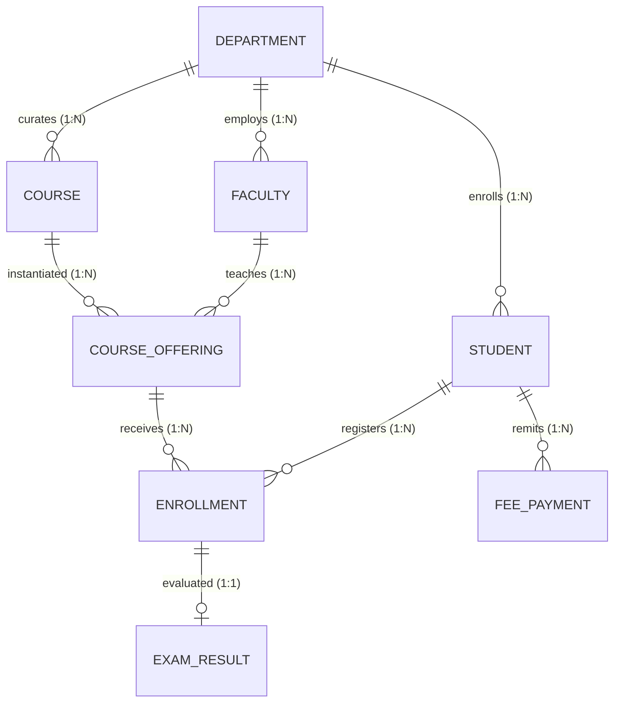

# BCSE302L – Database Systems: Review I Report
# COLLEGE MANAGEMENT SYSTEM

**Institution:** School of Computer Science and Engineering, Vellore Institute of Technology  
**Course Code & Title:** BCSE302L – Database Systems  
**Faculty In-Charge:** Course Instructor  

### Project Team Details:
| Student Name | Registration Number | Degree / Specialization | Role & Contribution |
| :--- | :--- | :--- | :--- |
| **Ansh** | **REG_01** | B.Tech Data Engineering | Project Lead, ER Modeling, DDL & Relational Schema |
| **Student 2** | **REG_02** | B.Tech Computer Science | Backend PL/SQL Architecture, Stored Procedures & Triggers |
| **Student 3** | **REG_03** | B.Tech Data Engineering | Database Population, Analytical Queries & Application Bridge |

---

## 1. Project Title and Problem Statement

### 1.1 Project Title
**COLLEGE MANAGEMENT SYSTEM (CMS)** – A Normalized, Enterprise Relational Database Application.

### 1.2 Problem Statement
Modern higher educational institutions process thousands of daily academic transactions across admissions, curriculum planning, course section allocations, student registrations, continuous evaluations, and tuition collections. Traditional or spreadsheet-based record keeping suffers from severe systemic vulnerabilities:
1. **Data Redundancy & Inconsistency:** Student and faculty attributes duplicated across disparate departmental files lead to conflicting phone numbers, addresses, and academic records.
2. **Lack of Referential Integrity:** Course offerings are scheduled without verifying faculty workloads, leading to double-booking and phantom course registrations.
3. **Absence of Capacity Enforcement:** Course registrations exceed classroom limits because enrollment counts are not synchronized in real time with seating capacities.
4. **Grading Errors & Inflexibility:** Manual transcription of examination marks frequently violates scale constraints (0–100) and produces inconsistent letter grade allocations.
5. **Untracked Tuition Arrears:** Disconnected financial records obscure whether students sitting for examinations have cleared mandatory tuition dues.

### 1.3 Project Objective
The objective is to architect and implement a fully normalized, high-integrity relational database system consisting of **exactly 8 strongly related tables** governed by foreign keys, check constraints, unique constraints, and automated business logic. The system strictly demonstrates the closed-loop lifecycle:
$$\text{User Operation} \longrightarrow \text{Application Interface} \longrightarrow \text{SQL / PL/SQL Logic} \longrightarrow \text{Relational Engine} \longrightarrow \text{Database State Update} \longrightarrow \text{Verified Result}$$

---

## 2. Operational Scope and User Roles

The College Management System models four distinct institutional user classes:

```
                  ┌──────────────────────────────────────────────┐
                  │          College Management System           │
                  └──────────────────────┬───────────────────────┘
                                         │
        ┌──────────────────┬─────────────┴──────┬──────────────────┐
        ▼                  ▼                    ▼                  ▼
┌───────────────┐  ┌───────────────┐    ┌───────────────┐  ┌───────────────┐
│   Students    │  │    Faculty    │    │  Department   │  │ Institutional │
│               │  │               │    │  HODs / Deans │  │  Finance /    │
│ - View catalog│  │ - View class  │    │ - Monitor     │  │  Accounts     │
│ - Register    │  │   roster      │    │   curricula   │  │ - Collect fees│
│   courses     │  │ - Grade exams │    │ - Audit       │  │ - Generate fee│
│ - Check grades│  │ - Track course│    │   budgets     │  │   receipts    │
│ - Pay tuition │  │   offerings   │    │ - Student GPA │  │ - Identify    │
└───────────────┘  └───────────────┘    └───────────────┘  └───────────────┘
```

---

## 3. Entity Specification & Attribute Dictionary

The database consists of **8 core entities**:

### 1. DEPARTMENT
Represents the organizational academic divisions within the university.
- `dept_id` (INTEGER, Primary Key): Unique numeric departmental identifier.
- `dept_name` (VARCHAR(100), UNIQUE, NOT NULL): Official departmental title (e.g., 'Computer Science and Engineering').
- `dept_code` (VARCHAR(10), UNIQUE, NOT NULL): Standard acronym code (e.g., 'CSE', 'DSAI').
- `building` (VARCHAR(100), NOT NULL): Campus facility housing the department.
- `budget` (DECIMAL(12,2), NOT NULL, CHECK > 0): Annual operational budget allocation.
- `established_year` (INTEGER, NOT NULL, CHECK between 1950 and 2026): Year founded.

### 2. FACULTY
Represents professors and instructional staff employed by departments.
- `faculty_id` (INTEGER, Primary Key): Unique faculty staff ID.
- `first_name`, `last_name` (VARCHAR(50), NOT NULL): Personal identification.
- `email` (VARCHAR(100), UNIQUE, NOT NULL): Institutional email address.
- `phone` (VARCHAR(15), UNIQUE, NOT NULL): Contact phone number.
- `hire_date` (DATE, NOT NULL): Date of joining.
- `designation` (VARCHAR(50), NOT NULL, CHECK IN ('Professor', 'Associate Professor', 'Assistant Professor', 'Lecturer', 'Dean', 'HOD')).
- `salary` (DECIMAL(10,2), NOT NULL, CHECK >= 25000): Monthly remuneration.
- `dept_id` (INTEGER, Foreign Key referencing `DEPARTMENT.dept_id`, NOT NULL).

### 3. STUDENT
Represents admitted degree candidates pursuing academic programs.
- `student_id` (INTEGER, Primary Key): Unique institutional student ID.
- `reg_no` (VARCHAR(20), UNIQUE, NOT NULL): Official University Registration Number (e.g., 'REG_01').
- `first_name`, `last_name` (VARCHAR(50), NOT NULL): Candidate's full name.
- `email` (VARCHAR(100), UNIQUE, NOT NULL): University email address.
- `phone` (VARCHAR(15), UNIQUE, NOT NULL): Mobile contact.
- `date_of_birth` (DATE, NOT NULL): Date of birth.
- `gender` (VARCHAR(10), NOT NULL, CHECK IN ('Male', 'Female', 'Other')).
- `admission_date` (DATE, NOT NULL): Formal enrollment date.
- `dept_id` (INTEGER, Foreign Key referencing `DEPARTMENT.dept_id`, NOT NULL).
- `current_semester` (INTEGER, NOT NULL, DEFAULT 1, CHECK BETWEEN 1 AND 8).
- `status` (VARCHAR(15), NOT NULL, DEFAULT 'Active', CHECK IN ('Active', 'Graduated', 'Suspended', 'Withdrawn')).

### 4. COURSE
Represents curriculum course catalog items.
- `course_id` (INTEGER, Primary Key): Internal course ID.
- `course_code` (VARCHAR(15), UNIQUE, NOT NULL): Official course acronym (e.g., 'BCSE302L').
- `course_title` (VARCHAR(100), NOT NULL): Descriptive course title.
- `credits` (INTEGER, NOT NULL, CHECK BETWEEN 1 AND 6): Academic credit value.
- `dept_id` (INTEGER, Foreign Key referencing `DEPARTMENT.dept_id`, NOT NULL).
- `course_level` (VARCHAR(20), NOT NULL, CHECK IN ('Introductory', 'Intermediate', 'Advanced', 'Elective')).

### 5. COURSE_OFFERING
Represents a scheduled course section instructed by a specific faculty member.
- `offering_id` (INTEGER, Primary Key): Unique section offering ID.
- `course_id` (INTEGER, Foreign Key referencing `COURSE.course_id`, NOT NULL).
- `faculty_id` (INTEGER, Foreign Key referencing `FACULTY.faculty_id`, NOT NULL).
- `academic_year` (VARCHAR(10), NOT NULL): Academic session (e.g., '2025-2026').
- `semester` (INTEGER, NOT NULL, CHECK BETWEEN 1 AND 8).
- `classroom` (VARCHAR(50), NOT NULL): Lecture hall / lab venue.
- `max_capacity` (INTEGER, NOT NULL, CHECK >= 10): Maximum seats.
- `current_enrolled` (INTEGER, NOT NULL, DEFAULT 0, CHECK between 0 and `max_capacity`).
- *Candidate Key Constraint:* `UNIQUE (course_id, faculty_id, academic_year, semester)`.

### 6. ENROLLMENT
Represents a student's registration into a course offering.
- `enrollment_id` (INTEGER, Primary Key): Unique enrollment ledger number.
- `student_id` (INTEGER, Foreign Key referencing `STUDENT.student_id`, NOT NULL).
- `offering_id` (INTEGER, Foreign Key referencing `COURSE_OFFERING.offering_id`, NOT NULL).
- `enrollment_date` (DATE, NOT NULL, DEFAULT CURRENT_DATE).
- `status` (VARCHAR(15), NOT NULL, DEFAULT 'Enrolled', CHECK IN ('Enrolled', 'Completed', 'Dropped')).
- *Candidate Key Constraint:* `UNIQUE (student_id, offering_id)`.

### 7. EXAM_RESULT
Represents formal evaluation marks and letter grades awarded to an enrolled student.
- `result_id` (INTEGER, Primary Key): Unique grade transcript ID.
- `enrollment_id` (INTEGER, Foreign Key referencing `ENROLLMENT.enrollment_id`, NOT NULL, UNIQUE).
- `marks_obtained` (DECIMAL(5,2), NOT NULL, CHECK BETWEEN 0.00 AND 100.00).
- `grade` (VARCHAR(2), NOT NULL, CHECK IN ('S', 'A', 'B', 'C', 'D', 'E', 'F')).
- `exam_date` (DATE, NOT NULL, DEFAULT CURRENT_DATE).
- `remarks` (VARCHAR(100), DEFAULT 'Regular Evaluation').

### 8. FEE_PAYMENT
Tracks student tuition remittances and bank transaction references.
- `payment_id` (INTEGER, Primary Key): Transaction voucher ID.
- `student_id` (INTEGER, Foreign Key referencing `STUDENT.student_id`, NOT NULL).
- `amount_paid` (DECIMAL(10,2), NOT NULL, CHECK > 0).
- `payment_date` (DATE, NOT NULL, DEFAULT CURRENT_DATE).
- `payment_method` (VARCHAR(20), NOT NULL, CHECK IN ('Credit Card', 'Debit Card', 'UPI', 'Net Banking', 'Cash')).
- `transaction_ref` (VARCHAR(50), NOT NULL, UNIQUE): Unique bank reference code.
- `payment_status` (VARCHAR(15), NOT NULL, DEFAULT 'Success', CHECK IN ('Success', 'Pending', 'Failed')).

---

## 4. Entity-Relationship (ER) Architecture and Cardinalities



### Cardinality Analysis:
1. **DEPARTMENT : STUDENT (1 to N):** One department admits many students; each student is enrolled in exactly one department.
2. **DEPARTMENT : FACULTY (1 to N):** One department appoints multiple faculty; a faculty member has one primary department.
3. **DEPARTMENT : COURSE (1 to N):** One department develops multiple curriculum courses; each course is owned by one department.
4. **FACULTY : COURSE_OFFERING (1 to N):** One professor can teach multiple term sections; each course section has one primary instructor.
5. **COURSE : COURSE_OFFERING (1 to N):** A course catalog entry can have multiple term sections over different semesters.
6. **STUDENT : COURSE_OFFERING (M to N, resolved via ENROLLMENT):** A student takes many courses; a section enrolls many students. Resolved cleanly via `ENROLLMENT` with `UNIQUE(student_id, offering_id)`.
7. **ENROLLMENT : EXAM_RESULT (1 to 1):** Each course enrollment produces exactly one final grade report.
8. **STUDENT : FEE_PAYMENT (1 to N):** A student pays tuition fees across multiple installments / semesters.

---

## 5. Relational Schema Conversion

```text
DEPARTMENT(dept_id [PK], dept_name [UQ], dept_code [UQ], building, budget, established_year)

FACULTY(faculty_id [PK], first_name, last_name, email [UQ], phone [UQ], hire_date, 
        designation, salary, dept_id [FK -> DEPARTMENT.dept_id])

STUDENT(student_id [PK], reg_no [UQ], first_name, last_name, email [UQ], phone [UQ], 
        date_of_birth, gender, admission_date, dept_id [FK -> DEPARTMENT.dept_id], 
        current_semester, status)

COURSE(course_id [PK], course_code [UQ], course_title, credits, 
       dept_id [FK -> DEPARTMENT.dept_id], course_level)

COURSE_OFFERING(offering_id [PK], course_id [FK -> COURSE.course_id], 
                faculty_id [FK -> FACULTY.faculty_id], academic_year, semester, 
                classroom, max_capacity, current_enrolled, 
                UNIQUE(course_id, faculty_id, academic_year, semester))

ENROLLMENT(enrollment_id [PK], student_id [FK -> STUDENT.student_id], 
           offering_id [FK -> COURSE_OFFERING.offering_id], enrollment_date, status, 
           UNIQUE(student_id, offering_id))

EXAM_RESULT(result_id [PK], enrollment_id [FK -> ENROLLMENT.enrollment_id, UQ], 
            marks_obtained, grade, exam_date, remarks)

FEE_PAYMENT(payment_id [PK], student_id [FK -> STUDENT.student_id], amount_paid, 
            payment_date, payment_method, transaction_ref [UQ], payment_status)
```

---

## 6. Normalization Justification (1NF, 2NF, 3NF, BCNF)

- **First Normal Form (1NF):** All attributes contain only atomic values. There are no multi-valued attributes (e.g., student contact numbers are single atomic values; course offerings are independent rows).
- **Second Normal Form (2NF):** All tables have single-attribute primary keys (surrogate keys), eliminating any partial functional dependency. Every non-key attribute is fully functionally dependent on the entire primary key.
- **Third Normal Form (3NF):** No transitive dependencies ($X \to Y \to Z$) exist. Non-key attributes depend directly on the candidate keys. For instance, course credits depend on `course_id`, not on `offering_id` or `enrollment_id`.
- **Boyce-Codd Normal Form (BCNF):** For every non-trivial functional dependency $X \to Y$, $X$ is a superkey. Candidate keys (`dept_code`, `reg_no`, `course_code`, `transaction_ref`, `(student_id, offering_id)`) are guarded by `UNIQUE` constraints.

---

## 7. Review I Viva Defense Preparation

### Q1: Why did you separate COURSE from COURSE_OFFERING?
*Answer:* A catalog course (e.g., `BCSE302L - Database Systems`, 4 credits) represents an abstract curriculum definition that remains permanent. A course offering represents a specific term instance (e.g., Winter 2025–2026, taught by Course Instructor in TT-401). If combined, the course title and credits would repeat for every section, creating insertion anomalies and violating 3NF.

### Q2: How is the Many-to-Many relationship between STUDENT and COURSE_OFFERING resolved?
*Answer:* It is resolved using the associative entity `ENROLLMENT`, with foreign keys referencing `STUDENT(student_id)` and `COURSE_OFFERING(offering_id)`, along with a `UNIQUE(student_id, offering_id)` constraint to prevent duplicate registrations.

### Q3: Why is EXAM_RESULT linked to ENROLLMENT instead of directly to STUDENT and COURSE?
*Answer:* A student can only receive an exam result if they were officially registered in that course section. Linking `EXAM_RESULT` to `ENROLLMENT` guarantees referential integrity, eliminates redundant composite foreign keys, and enforces a clean 1:1 evaluation mapping.

### Q4: How is seat capacity enforced?
*Answer:* The `COURSE_OFFERING` table includes `max_capacity` and `current_enrolled` with a check constraint `CHECK (current_enrolled <= max_capacity)`. Additionally, our database triggers and PL/SQL procedure `Enroll_Student_Proc` check seat availability prior to insertion and reject any registration exceeding capacity.
