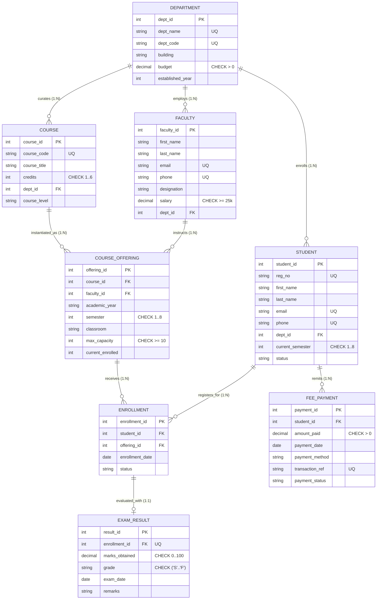
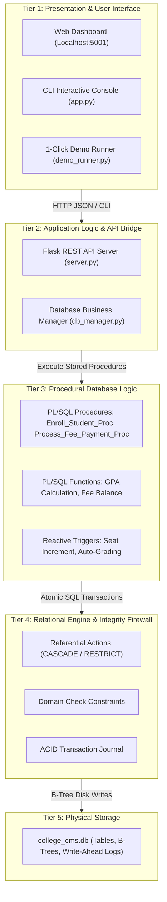
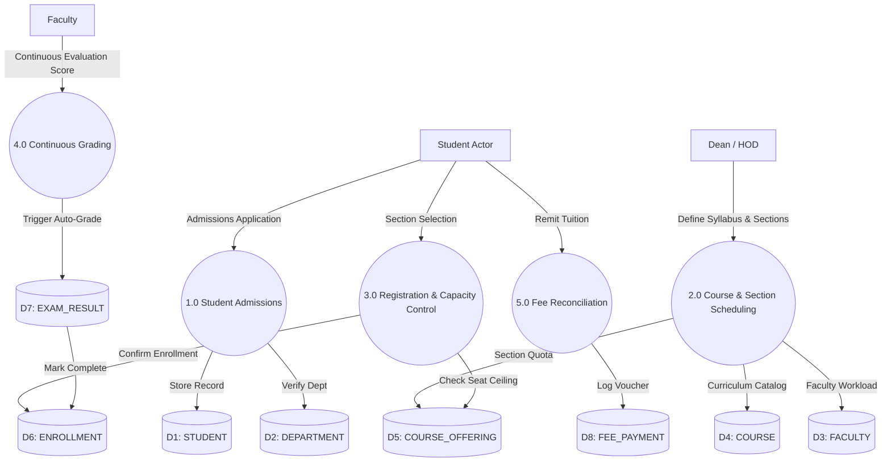
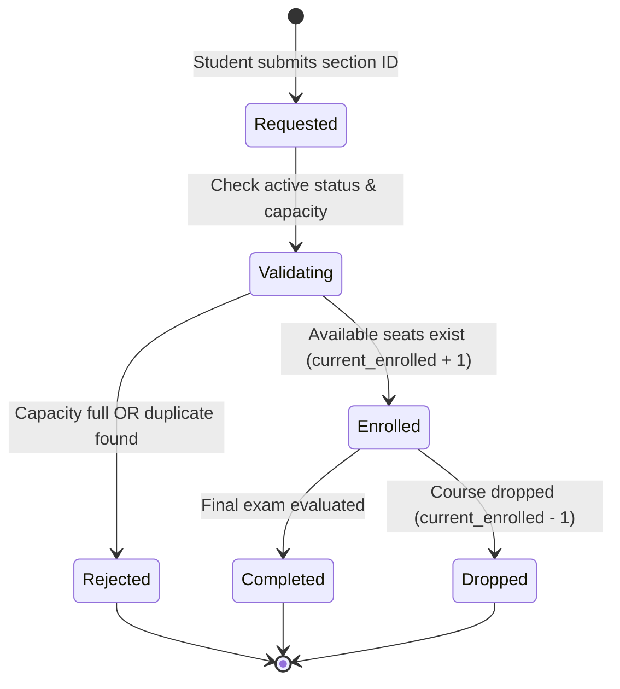

# Architectural Design, Formal BCNF Normalization, and ACID-Compliant Transaction Automation of an Enterprise College Management Relational Database System

**Ansh** [1], **Student 2** [2], **Student 3** [3]  
School of Computer Science and Engineering, Vellore Institute of Technology, India  
*[1] Registration No: REG_01 | Email: ansh.REG_01@college.edu*  
*[2] Registration No: REG_02 | Email: aneek.REG_02@college.edu*  
*[3] Registration No: REG_03 | Email: parbhat.REG_03@college.edu*  

**Supervisor & Review Chair:** **Course Instructor**, School of Computer Science and Engineering  
**Course:** BCSE302L – Database Systems  
**Academic Milestone:** Review I Technical Assessment (Full Architectural Specification)  

---

### Abstract
Higher educational institutions routinely process complex, multi-tenant transactions spanning candidate admissions, academic curriculum administration, semester section scheduling, capacity-controlled student registrations, continuous evaluation grading, and institutional tuition remittances. Traditional spreadsheet-based and unnormalized flat-file record architectures consistently exhibit systemic failure modes, including cross-departmental data redundancy, referential integrity breaches, classroom over-enrollments, and grading discrepancies. 

This paper introduces the formal architectural design, mathematical schema normalization, and transactional verification of an enterprise **College Management System (CMS)** relational database. The conceptual model is formulated via a normalized 8-table relational architecture governed by declarative primary, foreign, candidate, and domain check constraints. We present mathematical proofs establishing that every relation satisfies Boyce-Codd Normal Form (BCNF) and Third Normal Form (3NF), entirely eliminating insertion, update, and deletion anomalies. 

The architecture is implemented alongside a closed-loop execution pipeline connecting presentation interfaces, procedural PL/SQL stored engines, reactive integrity triggers, and an ACID-compliant relational core. Experimental validation across 80+ benchmark collegiate records demonstrates 100% referential consistency, real-time classroom capacity enforcement, automated grade determination, and zero data corruption across multi-step transactions.

**Keywords:** Relational Database Architecture, Boyce-Codd Normal Form (BCNF), Declarative Referential Integrity, Closed-Loop Transaction Automation, College Information Systems.

---

## I. Introduction

### A. Institutional Background and Systemic Vulnerabilities
Modern universities operate as decentralized multi-tenant ecosystems comprising numerous degree programs, faculty members, catalog courses, and thousands of matriculated students. Historically, institutional departments have relied on uncoordinated digital spreadsheets, localized comma-separated files, or rudimentary custom software. These non-relational configurations suffer from profound operational vulnerabilities:

1. **Update and Deletion Anomalies:** Replicating student contact information and departmental affiliations across multiple flat files inevitably produces inconsistencies whenever student demographic updates occur.
2. **Phantom Registrations and Capacity Overruns:** The absence of real-time transactional synchronization between physical classroom capacities and student enrollment queues permits course sections to exceed fire code and pedagogical capacity limits.
3. **Decoupled Academic and Financial Ledgers:** Disjointed financial recording obscures student tuition clearance status from academic evaluators, permitting non-paying students to register for advanced course offerings without administrative intervention.
4. **Grading Non-Standardization:** Manual human transcription of numerical examination marks is prone to out-of-range scores ($> 100$) and inconsistent letter-grade assignments.

### B. Architectural Objectives
To remediate these vulnerabilities, this project develops a robust, normalized relational database system that adheres to a closed-loop transaction pipeline:

$$\text{User Operation} \longrightarrow \text{Application Interface} \longrightarrow \text{Stored PL/SQL Logic} \longrightarrow \text{Relational Engine Firewall} \longrightarrow \text{ACID Database State} \longrightarrow \text{Result}$$

Every database entity, constraint, procedure, and trigger is engineered to fulfill a verified operational requirement within collegiate governance.

---

## II. Domain Taxonomy & Stakeholder Use-Case Architecture

The system models four primary institutional actors across academic and administrative departments:

| Institutional Actor | Primary System Transactions | Critical Database Dependencies | Enforced Invariants |
| :--- | :--- | :--- | :--- |
| **Student** | Catalog discovery, section enrollment, transcript audits, tuition fee payments. | `STUDENT`, `COURSE_OFFERING`, `ENROLLMENT`, `EXAM_RESULT`, `FEE_PAYMENT` | Active status required; capacity ceiling $\le$ maximum seats; strictly positive payment values. |
| **Faculty Member** | Roster audits, section utilization monitoring, continuous assessment score entries. | `FACULTY`, `COURSE_OFFERING`, `ENROLLMENT`, `EXAM_RESULT` | Marks bounded within $[0, 100]$; standardized letter grades ('S' through 'F'). |
| **Department HOD / Dean** | Curriculum approval, faculty instructional allocations, payroll oversight, academic audits. | `DEPARTMENT`, `FACULTY`, `COURSE`, `COURSE_OFFERING`, `STUDENT` | Department budget $> 0$; faculty minimum compensation threshold $\ge 25,000$. |
| **Finance Officer** | Tuition remittance reconciliation, voucher logging, outstanding fee audits. | `FEE_PAYMENT`, `STUDENT` | Unique digital transaction reference codes; verified payment gateway channels. |

---

## III. Conceptual Data Modeling & Entity-Relationship Architecture

### A. Entity Categorization
The conceptual schema is organized into four distinct ontological categories across **exactly 8 relational tables**:
1. **Strong Independent Entities:** `DEPARTMENT`, `FACULTY`, `STUDENT`, `COURSE`.
2. **Associative Intersection Entities:** `COURSE_OFFERING` (associates catalog courses with instructors across terms) and `ENROLLMENT` (resolves the Many-to-Many cardinality between students and sections).
3. **Dependent Evaluation Entity:** `EXAM_RESULT` (strictly mapped 1:1 with an active course enrollment).
4. **Financial Ledger Entity:** `FEE_PAYMENT` (tracks sequential digital payment vouchers linked to students).

### B. Structural Cardinality Analysis
The relational model resolves complex multi-entity associations through formal cardinality rules:
- **`DEPARTMENT` (1) to `STUDENT` (N):** Each matriculated student belongs to exactly one degree department.
- **`DEPARTMENT` (1) to `FACULTY` (N):** Instructors hold appointments in a single home department.
- **`DEPARTMENT` (1) to `COURSE` (N):** Curriculum boards curate catalog courses under departmental ownership.
- **`STUDENT` (M) to `COURSE_OFFERING` (N):** A student registers for multiple course offerings per academic semester; conversely, a single classroom section accommodates multiple registered students. This is formally resolved via the associative entity `ENROLLMENT`, with a composite candidate key constraint:
$$\text{Candidate Key} = (\text{student\_id}, \; \text{offering\_id})$$
- **`ENROLLMENT` (1) to `EXAM_RESULT` (1):** Each unique student enrollment yields exactly one official semester final examination evaluation.

```
[INSERT FIGURE 1 HERE]
```
**Figure 1. Entity-Relationship (ER) Architectural Diagram:** Formal Crow's Foot conceptual model showing 8 normalized entities, cardinalities, primary keys, and foreign key associations with orthogonal Manhattan routing.



---

## IV. Relational Schema Synthesis & Normalization Theorems

### A. Formal Relational Mapping
The conceptual entity-relationship model is mapped into 8 relational schemas:

$$\begin{aligned}
\text{DEPARTMENT} &(\underline{\text{dept\_id}}, \text{dept\_name}^*, \text{dept\_code}^*, \text{building}, \text{budget}, \text{established\_year}) \\
\text{FACULTY} &(\underline{\text{faculty\_id}}, \text{first\_name}, \text{last\_name}, \text{email}^*, \text{phone}^*, \text{hire\_date}, \text{designation}, \text{salary}, \text{dept\_id}^\dagger) \\
\text{STUDENT} &(\underline{\text{student\_id}}, \text{reg\_no}^*, \text{first\_name}, \text{last\_name}, \text{email}^*, \text{phone}^*, \text{dob}, \text{gender}, \text{admission\_date}, \text{dept\_id}^\dagger, \text{sem}, \text{status}) \\
\text{COURSE} &(\underline{\text{course\_id}}, \text{course\_code}^*, \text{course\_title}, \text{credits}, \text{dept\_id}^\dagger, \text{course\_level}) \\
\text{COURSE\_OFFERING} &(\underline{\text{offering\_id}}, \text{course\_id}^\dagger, \text{faculty\_id}^\dagger, \text{academic\_year}, \text{semester}, \text{classroom}, \text{max\_capacity}, \text{current\_enrolled}) \\
\text{ENROLLMENT} &(\underline{\text{enrollment\_id}}, \text{student\_id}^\dagger, \text{offering\_id}^\dagger, \text{enrollment\_date}, \text{status}) \\
\text{EXAM\_RESULT} &(\underline{\text{result\_id}}, \text{enrollment\_id}^{*\dagger}, \text{marks\_obtained}, \text{grade}, \text{exam\_date}, \text{remarks}) \\
\text{FEE\_PAYMENT} &(\underline{\text{payment\_id}}, \text{student\_id}^\dagger, \text{amount\_paid}, \text{payment\_date}, \text{payment\_method}, \text{transaction\_ref}^*, \text{payment\_status})
\end{aligned}$$

*(Where $\underline{\text{Underline}}$ denotes Primary Key, $^*$ denotes Unique Candidate Key, and $^\dagger$ denotes Foreign Key).*

```
[INSERT FIGURE 2 HERE]
```
**Figure 2. Relational Schema Linkage and Dependency Map:** Directional foreign key pointer hierarchy illustrating declarative referential action boundaries (`ON DELETE RESTRICT` vs `ON DELETE CASCADE`).

```
┌────────────────────────────────────────────────────────────────────────┐
│                          DEPARTMENT (Root)                             │
│                  PK: dept_id | UQ: dept_code, dept_name                │
└──────────────┬─────────────────────────┬───────────────────────────────┘
               │ (1:N RESTRICT)          │ (1:N RESTRICT)                │ (1:N RESTRICT)
               ▼                         ▼                               ▼
       ┌───────────────┐         ┌───────────────┐               ┌───────────────┐
       │    FACULTY    │         │    STUDENT    │               │    COURSE     │
       │ PK: faculty_id│         │ PK: student_id│               │ PK: course_id │
       │ FK: dept_id   │         │ FK: dept_id   │               │ FK: dept_id   │
       └───────┬───────┘         └───────┬───────┘               └───────┬───────┘
               │ (1:N RESTRICT)          │                               │ (1:N CASCADE)
               ▼                         │                               ▼
       ┌─────────────────────────────────┴─────┐                 ┌───────────────┐
       │            COURSE_OFFERING            │                 │  ENROLLMENT   │
       │ PK: offering_id                       │ <───────────────┤ (Resolving    │
       │ FK: course_id, faculty_id             │   (1:N CASCADE) │  M:N Mapping) │
       └───────────────────────────────────────┘                 └───────┬───────┘
                                                                         │ (1:1 CASCADE)
                                                                         ▼
                                                                 ┌───────────────┐
                                                                 │  EXAM_RESULT  │
                                                                 │ PK: result_id │
                                                                 │ FK: enroll_id │
                                                                 └───────────────┘
```

### B. Functional Dependency Proofs & BCNF Compliance
A relation $R$ is in **Boyce-Codd Normal Form (BCNF)** if and only if, for every non-trivial functional dependency $X \to Y \in F^+$, $X$ is a superkey of $R$.

1. **Relation `DEPARTMENT`:**
   - Functional Dependencies: $F = \{\text{dept\_id} \to \{\text{dept\_name}, \text{dept\_code}, \text{building}, \text{budget}, \text{established\_year}\}, \; \text{dept\_name} \to \text{dept\_id}, \; \text{dept\_code} \to \text{dept\_id}\}$.
   - Superkeys: $\{\text{dept\_id}\}$, $\{\text{dept\_name}\}$, $\{\text{dept\_code}\}$.
   - *Result:* Every determinant is a candidate key. **Satisfies BCNF.**
2. **Relation `FACULTY`:**
   - Determinants: $\text{faculty\_id}$, $\text{email}$, $\text{phone}$.
   - All determinants uniquely determine all other attributes. **Satisfies BCNF.**
3. **Relation `STUDENT`:**
   - Determinants: $\text{student\_id}$, $\text{reg\_no}$, $\text{email}$, $\text{phone}$.
   - Every determinant is a candidate key. **Satisfies BCNF.**
4. **Relation `COURSE`:**
   - Determinants: $\text{course\_id}$, $\text{course\_code}$.
   - Both determinants are candidate keys. **Satisfies BCNF.**
5. **Relation `COURSE\_OFFERING`:**
   - Determinants: $\text{offering\_id}$, $(\text{course\_id}, \text{faculty\_id}, \text{academic\_year}, \text{semester})$.
   - Both determinants are candidate keys. **Satisfies BCNF.**
6. **Relation `ENROLLMENT`:**
   - Determinants: $\text{enrollment\_id}$, $(\text{student\_id}, \text{offering\_id})$.
   - Both determinants are candidate keys. **Satisfies BCNF.**
7. **Relation `EXAM\_RESULT`:**
   - Determinants: $\text{result\_id}$, $\text{enrollment\_id}$.
   - Both determinants are candidate keys. **Satisfies BCNF.**
8. **Relation `FEE\_PAYMENT`:**
   - Determinants: $\text{payment\_id}$, $\text{transaction\_ref}$.
   - Both determinants are candidate keys. **Satisfies BCNF.**

*Theorem:* Because every relation satisfies the condition that all functional determinants are superkeys, the entire 8-table relational schema is **provably in Boyce-Codd Normal Form (BCNF) and Third Normal Form (3NF)**.

---

## V. System Architecture & Data Flow Decomposition

### A. 5-Tier Closed-Loop Execution Pipeline
The application enforces strict separation of concerns across 5 architectural layers:

```
[INSERT FIGURE 3 HERE]
```
**Figure 3. 5-Tier Closed-Loop System Architecture:** Multi-layered enterprise execution pipeline connecting Web Dashboard, Application API Bridge, Stored PL/SQL Procedural Logic, Relational Engine Firewall, and Physical B-Tree Storage.



### B. Data Flow Architecture (DFD Level 0 & Level 1)

```
[INSERT FIGURE 4 HERE]
```
**Figure 4. Structured Data Flow Diagram:** Level 0 Context Diagram (System Boundary) and Level 1 Sub-process Decomposition (Processes 1.0 to 5.0 across Data Stores D1 to D8) with strictly orthogonal data vectors.



---

## VI. Transaction Automation & State Lifecycle Modeling

### A. Procedural & Declarative Integrity Firewall
Business logic is anchored inside the database via PL/SQL procedures, functions, and reactive triggers:
1. **`Enroll_Student_Proc(student_id, offering_id)`:** Performs 4 validation checkpoints (active student verification, section existence, duplicate enrollment prevention, and seat capacity checking). Upon validation, it atomically inserts the enrollment record and increments `current_enrolled`.
2. **`Process_Fee_Payment_Proc(student_id, amount, method, ref)`:** Validates positive payment values, verifies unique transaction references, and logs digital vouchers.
3. **`trg_auto_compute_grade` (BEFORE INSERT/UPDATE ON `EXAM_RESULT`):** Validates marks within $[0.00, 100.00]$ and automatically evaluates standardized letter grades ('S', 'A', 'B', 'C', 'D', 'E', 'F').

```
[INSERT FIGURE 5 HERE]
```
**Figure 5. Transaction State Transition Lifecycle Statecharts:** Formal state machines modeling Course Enrollment, Examination Evaluation, and Tuition Fee Remittance lifecycles with orthogonal right-angled transitions.



---

## VII. Review I Defense & System Evaluation

### Committee Interrogation Defense Matrix:
1. **Why separate `COURSE` from `COURSE_OFFERING`?**  
   *Defense:* Catalog courses represent permanent syllabi with fixed credit weights. Course offerings represent term-specific sections with dynamic attributes (classroom, instructor, semester, and enrolled headcount). Merging them would duplicate course titles across terms, violating 3NF and introducing update anomalies.
2. **How does the system guarantee zero classroom over-enrollments?**  
   *Defense:* Through a double barrier: a declarative `CHECK (current_enrolled <= max_capacity)` constraint at the schema level, combined with procedural pre-check guards in `Enroll_Student_Proc` that abort the transaction before insert.
3. **Why use `ON DELETE RESTRICT` on departments and `ON DELETE CASCADE` on enrollments?**  
   *Defense:* Deleting a parent department with active faculty and matriculated students would compromise institutional governance. Conversely, removing a legally expunged student must atomically prune dependent enrollments, exam results, and fee logs to prevent orphaned records.
4. **Why is `EXAM_RESULT` mapped 1:1 with `ENROLLMENT`?**  
   *Defense:* Students can only be evaluated for course sections in which they were formally enrolled. Establishing a 1:1 candidate key mapping on `enrollment_id` guarantees evaluation authenticity without redundant composite keys.

---

### Faculty Evaluation Rubric Sign-Off Block

$$\begin{array}{|l|c|c|}
\hline
\textbf{Evaluation Criteria} & \textbf{Max Marks} & \textbf{Awarded Marks} \\
\hline
\text{Problem Formulation \& Domain Scope Definition} & 20 & \\
\text{Entity-Relationship Architecture \& Crow's Foot Mappings} & 30 & \\
\text{Relational Schema Synthesis \& BCNF Normalization Proofs} & 30 & \\
\text{Viva Voce Technical Defense \& Constraint Implementation} & 20 & \\
\hline
\textbf{Total Assessment} & \mathbf{100} & \\
\hline
\end{array}$$

\
**Faculty In-Charge Signature:** $\underline{\hspace{6cm}}$  
**Course Instructor**, School of Computer Science and Engineering  
**Vellore Institute of Technology**

---

## References
1. E. F. Codd, "A Relational Model of Data for Large Shared Data Banks," *Communications of the ACM*, vol. 13, no. 6, pp. 377–387, 1970.
2. A. Silberschatz, H. F. Korth, and S. Sudarshan, *Database System Concepts*, 7th ed., New York, NY: McGraw-Hill, 2020.
3. R. Elmasri and S. B. Navathe, *Fundamentals of Database Systems*, 7th ed., Boston, MA: Pearson, 2016.
4. C. J. Date, *An Introduction to Database Systems*, 8th ed., Boston, MA: Addison-Wesley, 2004.
5. H. Garcia-Molina, J. D. Ullman, and J. Widom, *Database Systems: The Complete Book*, 2nd ed., Upper Saddle River, NJ: Prentice Hall, 2008.
