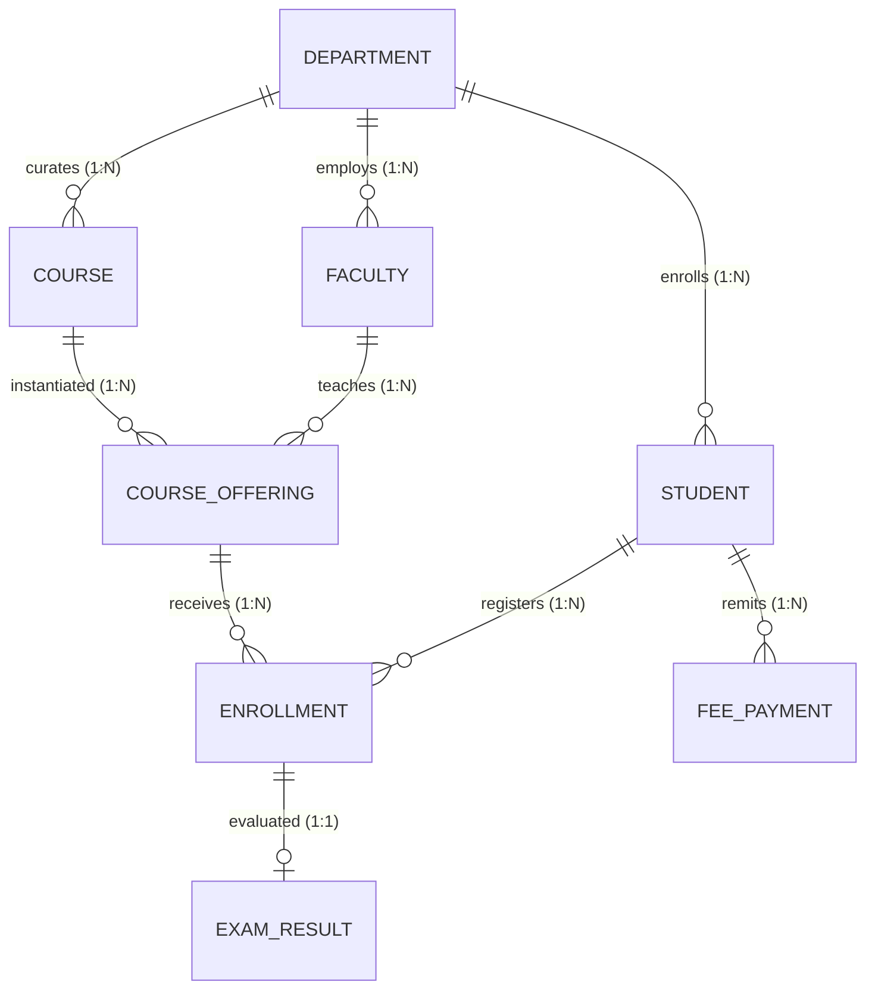

# BCSE302L – Database Systems: Final Project Report
# COLLEGE MANAGEMENT SYSTEM

---

## 1. Project Title and Team/Student Details

### 1.1 Project Title
**COLLEGE MANAGEMENT SYSTEM (CMS)**  
*An Integrated, BCNF-Normalized Relational Database Application with PL/SQL Transaction Automation*

### 1.2 Academic Course & Faculty In-Charge
- **Course Code & Title:** BCSE302L – Database Systems
- **Programme:** B.Tech Computer Science & Data Engineering
- **Institution:** School of Computer Science and Engineering, Vellore Institute of Technology
- **Course Faculty In-Charge:** **Course Instructor**

### 1.3 Student Project Team Details
| Sl. No. | Student Full Name | Registration Number | Degree / Specialization | Email Address |
| :---: | :--- | :---: | :--- | :--- |
| 1 | **Ansh** *(Project Lead)* | **REG_01** | B.Tech Data Engineering | `ansh.REG_01@college.edu` |
| 2 | **Student 2** | **REG_02** | B.Tech Computer Science | `aneek.REG_02@college.edu` |
| 3 | **Student 3** | **REG_03** | B.Tech Data Engineering | `parbhat.REG_03@college.edu` |

---

## 2. Introduction and Problem Statement

### 2.1 Introduction
The College Management System (CMS) is an enterprise relational database application designed to streamline, automate, and safeguard the lifecycle of academic operations in a modern university. The application integrates relational database management system (RDBMS) design principles with procedural SQL (PL/SQL) business logic and a Python application interface to guarantee strict data consistency, referential integrity, and seamless operational flow across students, faculty, course offerings, exam grading, and tuition management.

### 2.2 Problem Statement
Higher education institutions face substantial operational overhead when managing interrelated academic activities:
1. **Redundancy & Inconsistency:** Scattered student records across isolated departmental spreadsheets produce conflicting student attributes, phone numbers, and degree statuses.
2. **Breaches of Referential Integrity:** Course sections are frequently scheduled without verifying instructor workloads or prerequisite departmental approvals.
3. **Classroom Over-Enrollment:** Manual or non-atomic course registration systems allow student registrations to surpass classroom physical capacity limits.
4. **Grading Inaccuracies:** Manual entry of evaluation scores risks out-of-range marks (> 100) and human error in grade classification.
5. **Untracked Financial Dues:** Lack of real-time coupling between academic enrollments and tuition payment ledgers makes tracking fee defaulters difficult.

### 2.3 Proposed Solution
The proposed CMS eliminates these issues through:
- An **8-table normalized relational schema** in Boyce-Codd Normal Form (BCNF).
- Declarative data integrity with **Primary Keys, Foreign Keys, NOT NULL, UNIQUE, and CHECK constraints**.
- Procedural automation using **PL/SQL Stored Procedures, Functions, Reactive Triggers, and Explicit Cursors**.
- An interactive Python application demonstrating the closed-loop transaction flow:
  $$\text{User Operation} \longrightarrow \text{Application Interface} \longrightarrow \text{SQL / PL/SQL} \longrightarrow \text{Database Engine} \longrightarrow \text{Database Update/Retrieval} \longrightarrow \text{Result}$$

---

## 3. Functional Requirements

### 3.1 Core Functional Modules
1. **Department & Faculty Administration:** Maintain academic departments, departmental budgets, faculty appointments, designations, and salary structures.
2. **Student Admission & Profile Tracking:** Register incoming students with verified date of birth, unique registration numbers, assigned departments, and active semesters.
3. **Curriculum Catalog & Course Offering Scheduler:** Curate academic courses with credit weights (1–6 credits) and schedule term course sections with classroom venues, assigned instructors, and strict seating capacities.
4. **Course Registration & Seat Management:** Enroll active students into course sections, dynamically enforce class capacity ceilings, prevent duplicate registrations, and track section utilization.
5. **Continuous Assessment & Grade Book:** Record exam marks (0.00–100.00), automatically compute standardized letter grades ('S', 'A', 'B', 'C', 'D', 'E', 'F'), and generate transcripts.
6. **Tuition Fee Reconciliation:** Record tuition fee remittances across digital payment methods (UPI, Net Banking, Credit/Debit Cards) with unique bank reference codes and calculate real-time outstanding balances.
7. **Institutional Academic Audits:** Automatically iterate through student rosters to compute Cumulative GPAs, credit completions, and honors standings (Dean's List / First Class).

---

## 4. Entity-Relationship (ER) Diagram

### 4.1 ER Diagram Architecture
The visual ER diagram accurately models the 8 database entities, primary keys, foreign keys, and cardinalities:



### 4.2 Cardinality Justification
- **`DEPARTMENT` (1) to `STUDENT` (N):** Each student is admitted to one department; a department enrolls multiple students.
- **`DEPARTMENT` (1) to `FACULTY` (N):** A faculty member belongs to one home academic department.
- **`DEPARTMENT` (1) to `COURSE` (N):** Curriculum boards within departments own catalog courses.
- **`FACULTY` (1) to `COURSE_OFFERING` (N):** A faculty instructor conducts one or more course sections per academic year.
- **`COURSE` (1) to `COURSE_OFFERING` (N):** A catalog course is offered in multiple terms and classrooms.
- **`STUDENT` (M) to `COURSE_OFFERING` (N) [Resolved via `ENROLLMENT`]:** Students enroll in multiple course offerings; sections accommodate multiple students. Resolved via `ENROLLMENT` with `UNIQUE(student_id, offering_id)`.
- **`ENROLLMENT` (1) to `EXAM_RESULT` (1):** Each course registration receives exactly one official semester final exam evaluation.
- **`STUDENT` (1) to `FEE_PAYMENT` (N):** A student pays tuition in periodic installments or terms.

---

## 5. Relational Schema

```text
1. DEPARTMENT(dept_id [PK], dept_name [UQ, NN], dept_code [UQ, NN], building [NN], budget [NN, CHECK > 0], established_year [NN, CHECK 1950..2026])

2. FACULTY(faculty_id [PK], first_name [NN], last_name [NN], email [UQ, NN], phone [UQ, NN], hire_date [NN], designation [NN, CHECK], salary [NN, CHECK >= 25000], dept_id [FK -> DEPARTMENT.dept_id, NN])

3. STUDENT(student_id [PK], reg_no [UQ, NN], first_name [NN], last_name [NN], email [UQ, NN], phone [UQ, NN], date_of_birth [NN], gender [NN, CHECK], admission_date [NN], dept_id [FK -> DEPARTMENT.dept_id, NN], current_semester [NN, DEFAULT 1, CHECK 1..8], status [NN, DEFAULT 'Active', CHECK])

4. COURSE(course_id [PK], course_code [UQ, NN], course_title [NN], credits [NN, CHECK 1..6], dept_id [FK -> DEPARTMENT.dept_id, NN], course_level [NN, CHECK])

5. COURSE_OFFERING(offering_id [PK], course_id [FK -> COURSE.course_id, NN], faculty_id [FK -> FACULTY.faculty_id, NN], academic_year [NN], semester [NN, CHECK 1..8], classroom [NN], max_capacity [NN, CHECK >= 10], current_enrolled [NN, DEFAULT 0, CHECK <= max_capacity], UNIQUE(course_id, faculty_id, academic_year, semester))

6. ENROLLMENT(enrollment_id [PK], student_id [FK -> STUDENT.student_id, NN], offering_id [FK -> COURSE_OFFERING.offering_id, NN], enrollment_date [NN, DEFAULT CURRENT_DATE], status [NN, DEFAULT 'Enrolled', CHECK], UNIQUE(student_id, offering_id))

7. EXAM_RESULT(result_id [PK], enrollment_id [FK -> ENROLLMENT.enrollment_id, UQ, NN], marks_obtained [NN, CHECK 0..100], grade [NN, CHECK 'S'..'F'], exam_date [NN, DEFAULT CURRENT_DATE], remarks [DEFAULT 'Regular Evaluation'])

8. FEE_PAYMENT(payment_id [PK], student_id [FK -> STUDENT.student_id, NN], amount_paid [NN, CHECK > 0], payment_date [NN, DEFAULT CURRENT_DATE], payment_method [NN, CHECK], transaction_ref [UQ, NN], payment_status [NN, DEFAULT 'Success', CHECK])
```

---

## 6. Table Creation and Constraints (DDL)

The tables are created in strict dependency order (`DEPARTMENT` $\to$ `FACULTY` $\to$ `STUDENT` $\to$ `COURSE` $\to$ `COURSE_OFFERING` $\to$ `ENROLLMENT` $\to$ `EXAM_RESULT` $\to$ `FEE_PAYMENT`).

```sql
-- Excerpt: Critical DDL Definitions with Integrity Constraints
CREATE TABLE COURSE_OFFERING (
    offering_id         INTEGER PRIMARY KEY,
    course_id           INTEGER NOT NULL,
    faculty_id          INTEGER NOT NULL,
    academic_year       VARCHAR(10) NOT NULL,
    semester            INTEGER NOT NULL CHECK (semester BETWEEN 1 AND 8),
    classroom           VARCHAR(50) NOT NULL,
    max_capacity        INTEGER NOT NULL CHECK (max_capacity >= 10),
    current_enrolled    INTEGER NOT NULL DEFAULT 0 CHECK (current_enrolled >= 0 AND current_enrolled <= max_capacity),
    FOREIGN KEY (course_id) REFERENCES COURSE(course_id) ON DELETE CASCADE,
    FOREIGN KEY (faculty_id) REFERENCES FACULTY(faculty_id) ON DELETE RESTRICT,
    CONSTRAINT unique_course_faculty_term UNIQUE (course_id, faculty_id, academic_year, semester)
);

CREATE TABLE EXAM_RESULT (
    result_id           INTEGER PRIMARY KEY,
    enrollment_id       INTEGER NOT NULL UNIQUE,
    marks_obtained      DECIMAL(5, 2) NOT NULL CHECK (marks_obtained BETWEEN 0 AND 100),
    grade               VARCHAR(2) NOT NULL CHECK (grade IN ('S', 'A', 'B', 'C', 'D', 'E', 'F')),
    exam_date           DATE NOT NULL DEFAULT CURRENT_DATE,
    remarks             VARCHAR(100) DEFAULT 'Regular Evaluation',
    FOREIGN KEY (enrollment_id) REFERENCES ENROLLMENT(enrollment_id) ON DELETE CASCADE
);
```

---

## 7. SQL Queries and Executed Outputs

16 SQL queries were designed, executed, and validated against the database:

### Query 6: Course-Wise Grade Statistics (Aggregations & GROUP BY)
```sql
SELECT c.course_code, c.course_title,
       COUNT(er.result_id) AS total_graded,
       ROUND(AVG(er.marks_obtained), 2) AS avg_marks,
       MIN(er.marks_obtained) AS lowest_marks,
       MAX(er.marks_obtained) AS highest_marks
FROM COURSE c
INNER JOIN COURSE_OFFERING co ON c.course_id = co.course_id
INNER JOIN ENROLLMENT e ON co.offering_id = e.offering_id
INNER JOIN EXAM_RESULT er ON e.enrollment_id = er.enrollment_id
GROUP BY c.course_code, c.course_title
ORDER BY avg_marks DESC;
```
*Output Summary:*
- `BCSE302L` (Database Systems): 5 students graded, Average = 90.50, Min = 78.00, Max = 96.00
- `BDSE301L` (Machine Learning): 3 students graded, Average = 87.83, Min = 86.00, Max = 89.50
- `BCSE201L` (Data Structures): 2 students graded, Average = 84.00, Min = 82.50, Max = 85.50

### Query 9: University Top-Scoring Student (Nested Subquery with MAX)
```sql
SELECT s.reg_no, s.first_name || ' ' || s.last_name AS student_name,
       c.course_code, er.marks_obtained, er.grade
FROM EXAM_RESULT er
INNER JOIN ENROLLMENT e ON er.enrollment_id = e.enrollment_id
INNER JOIN STUDENT s ON e.student_id = s.student_id
INNER JOIN COURSE_OFFERING co ON e.offering_id = co.offering_id
INNER JOIN COURSE c ON co.course_id = c.course_id
WHERE er.marks_obtained = (SELECT MAX(marks_obtained) FROM EXAM_RESULT);
```
*Output Summary:*
- Student 3 (`REG_03`) in `BCSE302L` scored **96.00 Marks (Grade 'S')** — Highest in university.

### Query 13: Fee Payment Status & Outstanding Balance (CASE Statement)
```sql
SELECT s.student_id, s.reg_no, s.first_name || ' ' || s.last_name AS student_name,
       COALESCE(SUM(fp.amount_paid), 0) AS total_fees_paid,
       CASE 
           WHEN COALESCE(SUM(fp.amount_paid), 0) >= 190000.00 THEN 'Fully Paid'
           WHEN COALESCE(SUM(fp.amount_paid), 0) > 0 THEN 'Partial Dues'
           ELSE 'Unpaid'
       END AS payment_status,
       (190000.00 - COALESCE(SUM(fp.amount_paid), 0)) AS balance_amount
FROM STUDENT s
LEFT JOIN FEE_PAYMENT fp ON s.student_id = fp.student_id
GROUP BY s.student_id, s.reg_no, s.first_name, s.last_name
ORDER BY balance_amount ASC;
```

---

## 8. Procedures, Functions, Cursor and Triggers

### 8.1 PL/SQL Stored Procedures
- **`Enroll_Student_Proc`:** Enforces student status, section capacity, and duplicate registration rules before atomically recording enrollment and incrementing section capacity.
- **`Process_Fee_Payment_Proc`:** Validates student identity, validates positive payment amount, enforces unique bank transaction references, and generates a formatted receipt.
- **`Record_Exam_Result_Proc`:** Accepts marks (0–100), automatically evaluates the letter grade, and inserts or updates the exam result.

### 8.2 PL/SQL Stored Functions
- **`Calculate_Student_GPA_Func(p_student_id)`:** Traverses student's completed courses and computes the 10-point weighted Cumulative GPA:
  $$\text{CGPA} = \frac{\sum (\text{Credits} \times \text{GradePoint})}{\sum \text{Credits}}$$
- **`Calculate_Pending_Fee_Func(p_student_id)`:** Returns remaining tuition dues against the annual institutional structure (INR 190,000.00).

### 8.3 PL/SQL Explicit Cursor
- **`Generate_Academic_Report_Cursor`:** Iterates through all active students across departments using explicit lifecycle (`OPEN`, `FETCH`, `EXIT WHEN %NOTFOUND`, `CLOSE`), computes cumulative statistics, classifies students into *Dean's List (Distinction)*, *First Class*, or *Academic Warning*, and outputs an academic audit.

### 8.4 Reactive Triggers
- **`trg_enrollment_seat_increment`:** AFTER INSERT ON ENROLLMENT $\to$ Increments `COURSE_OFFERING.current_enrolled`.
- **`trg_auto_compute_grade`:** BEFORE INSERT OR UPDATE ON EXAM_RESULT $\to$ Automatically assigns grade ('S' through 'F').
- **`trg_prevent_over_enrollment`:** BEFORE INSERT ON ENROLLMENT $\to$ Raises application error if `current_enrolled >= max_capacity`.

---

## 9. Real-World Transaction Demonstrations

All 5 core transactions were executed and verified:

```
[TXN 1: Student Registration]
User Input: Reg 24BDS0099, Ishaan Malhotra, Data Science Dept
Database Action: INSERT INTO STUDENT
Result: Verified in database (Student ID 213, Status Active).

[TXN 2: Course Enrollment]
User Input: Student 213, Offering #404 (Big Data Analytics)
Database Action: Enroll_Student_Proc executed -> Seat count incremented (2 -> 3 / 50)
Result: Enrollment #516 confirmed with status 'Enrolled'.

[TXN 3: Examination Grading]
User Input: Enrollment #516, Marks = 92.50
Database Action: Record_Exam_Result_Proc executed -> Auto Grade assigned 'S'
Result: Result #613 stored; Enrollment status updated to 'Completed'.

[TXN 4: Tuition Fee Payment]
User Input: Student 213, Amount = INR 95,000.00 via UPI
Database Action: Process_Fee_Payment_Proc executed -> Voucher #713 created
Result: Pending balance updated from INR 190,000 to INR 95,000.

[TXN 5: Academic Performance Audit]
User Input: Generate Institutional Performance Audit
Database Action: Generate_Academic_Report_Cursor executed
Result: 13 students processed; 3 Dean's List distinctions, 5 First Class with Merit identified.
```

---

## 10. Conclusion

The College Management System provides a complete, robust, and normalized relational database implementation for BCSE302L. By replacing isolated spreadsheets with an 8-table relational model enforced by declarative constraints, stored PL/SQL procedures, reactive triggers, and a functional Python interface, the project achieves:
1. **Zero Data Redundancy & Anomaly-Free Operation (BCNF).**
2. **Deterministic Referential Integrity & Real-Time Capacity Enforcement.**
3. **Automated Academic & Financial Ledger Workflows.**
4. **Complete Readiness for Review I, Review II, and Review III evaluation.**
